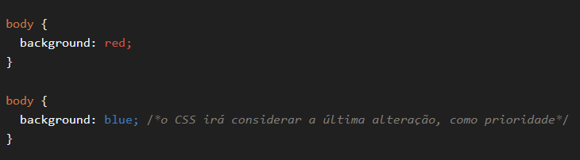
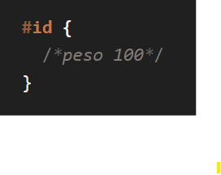
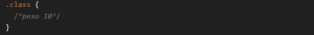
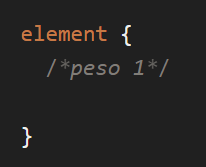
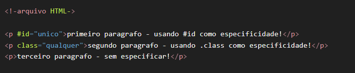
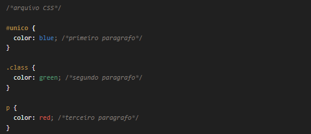
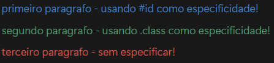
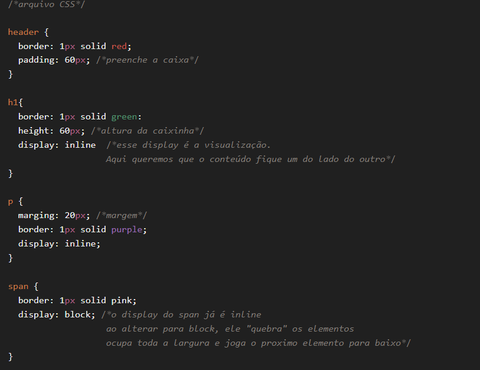
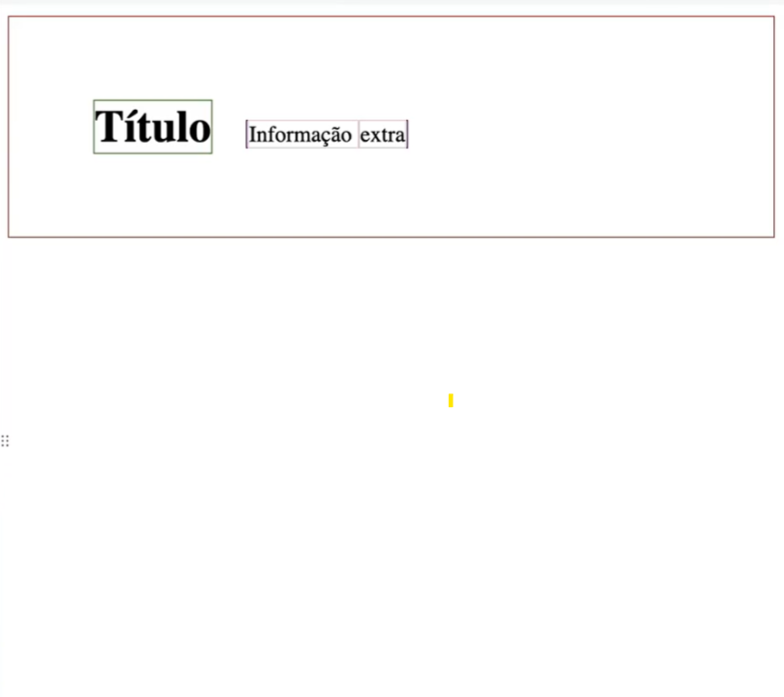
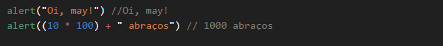

# Projeto Curso Discover  

> O propósito deste curso é nivelar conhecimentos de **HTML, CSS e JavaScript**.  
> Este é o meu formato de revisão para a **primeira avaliação** de Desenvolvimento de Aplicações Web.  

---
## HTML & CSS
### Cascading (Cascata)
- Quando há **duas (ou mais) declarações**, a **última** será a mais relevante.

### Specificity (Especificidade)
- Cada seletor tem um **peso** e a soma desses pesos define a prioridade.  
- Os tipos de especificidade são:  
  - **#id**  
  - **.class**  
  - **element**

> O efeito cascata **perde prioridade** quando há especificidade. A declaração mais específica é a que será aplicada.

- O efeito cascata **perde prioridade** e será priorizado a especificidade da declaração.

 

- Saída:

 

- Caso os pesos sejam **iguais** (ex.: dois parágrafos sem especificação), vale a **última declaração** (efeito cascata).

---

### Box Model 
- **Tudo em HTML são caixas!**
> Cada elemento é considerado uma caixa.

- Propriedades da caixa:  
  - conteúdo  
  - largura  
  - altura  
  - borda  
  - preenchimento (*padding*, espaço interno)  
  - espaçamento (*margin*, espaço externo)  

 
 

- Exemplo no navegador:  

 

---

## JavaScript

### O que é?
- Linguagem de programação **interpretada** e executada pelos navegadores.  
- É a **inteligência** da tríade:  
  - **HTML** → estrutura  
  - **CSS** → estilo  
  - **JavaScript** → comportamento  

> 🚫 Não é **JAVA**. Apesar do nome parecido, são linguagens diferentes.

---

### Por que será usado JS?
- Aplicativos
> para WEB, Desktop (Electron) e Mobile (React Native)

- Empresas Famosas 
> Instagram, Google, Netflix, Tiktok... entre outras

- Moderna e Viva 
> Comunidade e linguagem que cresce cada vez mais 

### Instruções e Sintaxe
- Toda linguagem é baseada em dois princípios:  

1. **Instruções (declarações):** ordens ao computador.  
2. **Sintaxe:** maneira correta de escrever. 

 

💬**Existem *palavras reservadas da linguagem*. Elas são responsáveis em dar significado a diversas instruções!!**

--- 

### Executando JavaScript
Formas de executar JS:  

- **Navegador (DevTools):** atalho `F12`.  
- **Plataformas online:** [fronteditor.dev](https://fronteditor.dev) e [codepen.io](https://codepen.io).  
- **Projeto local:** arquivos no computador.  

---

### Variáveis 
- Uma **caixinha** para guardar um tipo de dado e usar mais tarde.

---

### Tipos de Dados
- **Primitivos:**  
  - Textos (*string*)  
  - Números (*number*)  
  - Booleanos (*true/false*)  

- **Estruturados:**  
  - Arrays  
  - Objetos  

---

