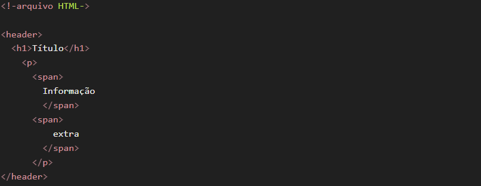

# Projeto Curso Discover
> o propósito deste curso é de nivelamento do HTML, CSS e JavaScript.
> Aqui é o meu formato de revisão para a primeira avaliação de Desenvolvimento de Aplicações Web.

---
## Cascading - Cascata
- Quando há 2 (ou mais) declarações, a última será mais relevante

## Specificity - Especificidade
- Cada seletor tem um peso e a soma dos pesos
- A soma desses pesos será levada em consideração, assim cada declaração será mais específica.
- Os tipos de especificação são <u>#id</u>, <u>.class</u>, <u>element</u>

- O efeito cascata **perde prioridade** e será priorizado a especificidade da declaração.

 

- Essa será a saída:

 

- caso os pesos sejam iguais (dois paragrafos sem especificação, por exemplo), a ultima alteração é a que conta (cascata)

## Box Model 
- Tudo são caixas!
> Todos os elementos HTML serão considerados uma caixa

- Caixas possuem determinadas propriedades
> essas propriedades são o seu **conteúdo, largura, altura, borda, preenchimento (espaço interno), espaçamento (espaço externo)**. 

 
 

- Ele aparece assim na web

 

